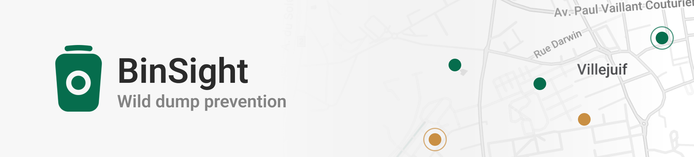

# BinSight

Web application for monitoring public waste bins. Users upload bin photos; the
app extracts image features, classifies each bin as clean (empty) or dirty
(full/overflowing) using configurable rules, lets users assign ground-truth
labels, and shows statistics, a model-training overview, and a map of bins
around the EFREI Paris campus (Villejuif).

Built for the EFREI MasterCamp Data project "Wild Dump Prevention".

## Requirements

- Python 3.9+
- See `requirements.txt` (Flask, Pillow, OpenCV, matplotlib, NumPy, scikit-learn)

## Setup

```
python3 -m venv venv
source venv/bin/activate
pip install -r requirements.txt
```

## Run

```
python app.py
```

Then open http://127.0.0.1:5000

On first run the database is created and seeded automatically from the dataset
in `Data/`.

Note: on macOS port 5000 is often used by AirPlay Receiver. If the app fails to
start, use another port:

```
PORT=5077 python app.py
```

## Train the classifier (optional)

A trained model is included. To retrain from the dataset:

```
python train.py
```

This compares several classifiers by cross-validation, applies semi-supervised
self-training on the unlabeled images, and writes `trained_model.pkl` and
`model_meta.json` (used by the Model page).

## Pages

- Dashboard: totals, class distribution, uploads over time, file-size
  distribution, recent uploads.
- Upload & annotate: upload or select an image, view its features, histogram,
  normalized view and predictions, then label it clean or dirty.
- Rules: edit the conditional-rule thresholds; saving re-classifies all images.
- Model: training data, cross-validation results, confusion matrix, feature
  importance and feature distributions.
- Map: bins around the EFREI campus, coloured by classification (Leaflet +
  CARTO Positron tiles).

## Structure

```
app.py            Flask entry point and routes
seed.py           Populate the database from the dataset
train.py          Train the classifier
requirements.txt
core/             Application library
  paths.py        Centralised file paths
  db.py           SQLite access
  features.py     Image feature extraction (Pillow + OpenCV)
  rules.py        Rule-based classifier
  model.py        ML model load / predict
  charts.py       Dashboard chart PNGs (matplotlib)
  modelviz.py     Model-page chart PNGs
  schema.sql      Database schema
templates/        Jinja2 templates
static/           CSS, images, uploaded photos
Data/             Image dataset (not in version control)
```

## Generated files

These are created at runtime and are not required in version control:
`binsight.db`, `trained_model.pkl`, `model_meta.json`, `features_cache.csv`,
and the contents of `static/uploads/`.
